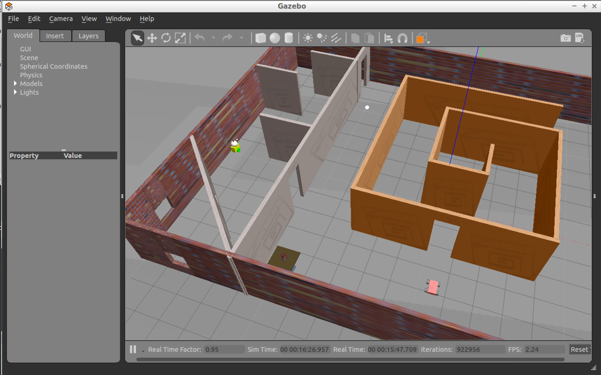
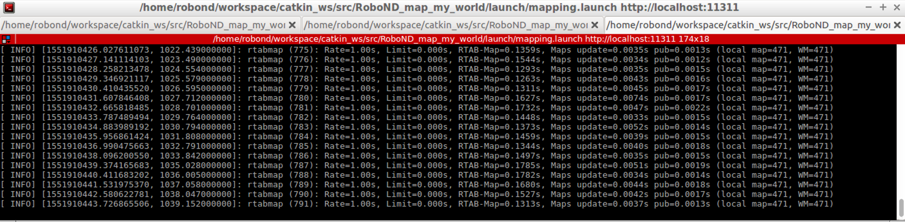
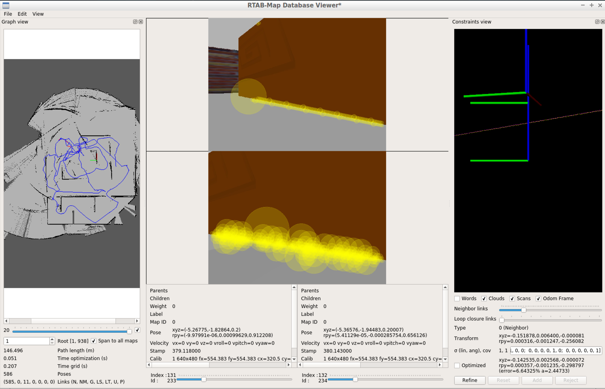

# RoboND_map_my_world

Udacity Robotics Nano Degree - Assignment 4

By: Reza Rahimi

## ROS and Gazebo

The project was developed on Ubuntu 16.04 LTS with ROS Kinetic, Gazebo. 

## Required packages:

ROS RTAB-Map package: 
http://wiki.ros.org/rtabmap_ros

ROS Teleop_twist_keyboard:
https://github.com/ros-teleop/teleop_twist_keyboard

After download, don’t forget to run rosdep install to download all dependencies.
  rosdep install rtabmap_ros

## To Run:

Start the custom world:
  roslaunch RoboND_map_my_world world.launch
  
Start teleop:
  roslaunch RoboND_map_my_world teleop.launch
  
Start rtabmap:
  roslaunch RoboND_map_my_world mapping.launch
  
  
## Optional: Localization

There is also a launch file to run localization using rtabmap:
  roslaunch RoboND_map_my_world localization.launch
  
## Generated RTABMAP database file:

An example of the database file that was created using the rtabmap can be downloaded from the dropbox link below. Please note that the size of the file is approx 460MB.

https://www.dropbox.com/s/75ote7ym091y546/rtabmap.db?dl=0

## Screenshots: 

Rviz:

Gazebo:

Shell running rtabmap:

RTAB-map db-viewer after creating the map:

